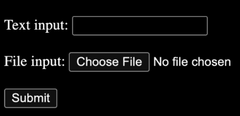
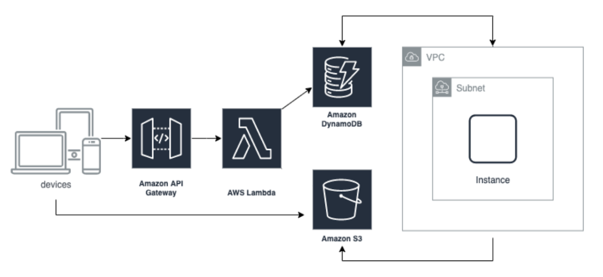

    <h1>Coding Challenge</h1>
    <h3>外企远程全职工作</h3>

1. 我们是美国企业，看重个人诚信，面试过程和工作中的任何失信行为与投机取巧之举都是零容忍。
1. 完成此项目后，只有两轮面试。
1. 不要求学历和经验，是为了给更多人机会。
1. 简单英语读写要求，会用翻译软件即可。
1. 此项目模拟我们现有产品技术栈，涵盖了我们用到的 80% 的 tools。
1. 非算法面试，是因为会做题不等于会做项目。
1. 非外包公司，直接跟美国公司签合同。
1. 本公司无法提供 AWS 测试账号，但香港 AWS 账号是可以免费申请的，只需双币信用卡验证，本项目只会用到免费的服务和资源。遇到任何 AWS 问题请咨询 AWS 客服，请不要私信我们。

You are invited to build a simple full-stack project within 5 days.  
Free tier AWS resources should be enough for this project. We are keeping hiring.

### System Components

+ Responsive web UI (use ReactJS) with a text input and a file input
    + Text input: “[InputText]” // [ ] means the string is changeable
    + File input: [InputFile].txt
        + [InputFile].txt content: “[File Content]”
    + Submit button
        

+ Upload the input file to S3 from the browser directly (do not send the file content directly to Lambda)
    + S3 path: [BucketName]/[InputFile].txt
+ Save the inputs and S3 path in DynamoDB FileTable via API gateway and Lambda Function
    + id : [1]  // auto-generated id via [nanoid](https://zelark.github.io/nano-id-cc/)
    + input_text: [InputText]
    + input_file_path: [BucketName]/[InputFile].txt
+ After the file is uploaded in S3 and added to DynamoDB, trigger a script run in a VM instance (EC2) via the DynamoDB Event. 
    1. Create a new VM automatically
    1. Download the script from S3 to the VM (Upload the scripts to S3 via CDK or programmatically as the InputFile)
    1. Run the script in the VM
        1. Get the inputs from DynamoDB FileTable by id
        1. Download the input file from S3 [BucketName]/[InputFile].txt to the VM
        1. iii.Append the retrieved input text to the downloaded input file and save it as [OutputFile].txt
            + [OutputFile].txt content: “[File Content] : [InputText]”
        1. Upload the output file to S3
            + 1.S3 path: [BucketName]/[OutputFile].txt
        1. Save the outputs and S3 path in DynamoDB FileTable
            1. id : [1]
            1. output_file_path: [BucketName]/[OutputFile].out.txt
    1. erminate the VM automatically

### Basic requirements

+ Use AWS CDK to manage AWS infrastructure (latest version)
+ Use AWS SDK JavaScript V3 for Lambda (latest version, not V2)
+ Do not put any AWS access key / credentials in your code.
+ No SSH and no hard-coded parameters.
+ Your parameter/variable names are reader-friendly.
+ Your txt file in S3 is not public.
+ Do not use any AWS Amplify frontend and backend resources.
+ Follow the AWS Best Practices.
+ After saving the inputs and S3 path in DynamoDB FileTable, your system will create a new VM (not a pre-provisioned VM) and trigger the script to run automatically with error handling.

### Bonus

+ **Early submission is a big plus**
+ Use AWS Cognito as API-Gateway Authorizer
+ Your frontend code is hosted in S3 or Amplify (not backend)
+ Use Flowbite TailwindCSS and ReactJS for Responsive UI

### To submit your project, please send <jobs@fovus.co> with the following Email titled “Coding Challenge Submission - [Full-time | Intern] - [Earliest job start date for this new job]”

+ Demo - screenshots or videos
+ Your source code (don't zip) in Cloud Drive or private git repo shared with xuanyi@fovus.co (don’t put it in any public git please)
+ A README on how to set up and run your code (make sure I can deploy your code and test it by following your steps)
+ A list of references that you used for coding.
+ Your latest resume.
+ Your online interview availability with us for the next 2 weeks.
+ If you are qualified (finish all basic requirements), you will get our interview invite within 5 days.

