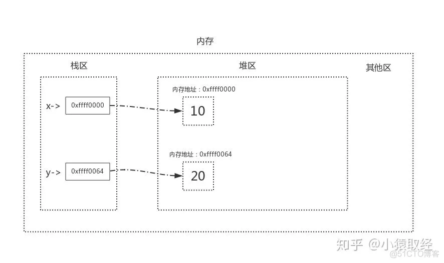
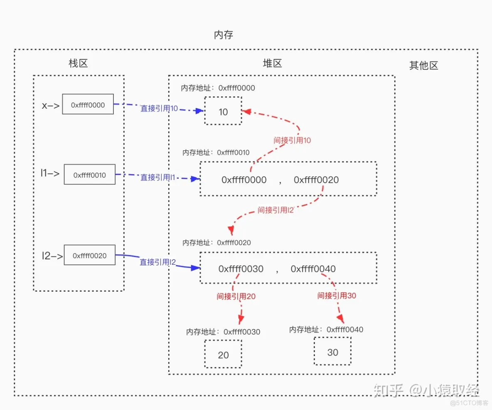
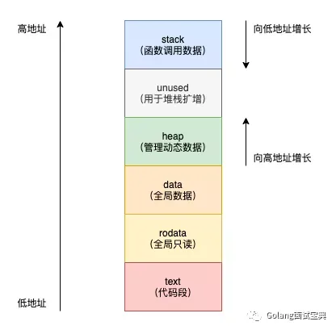
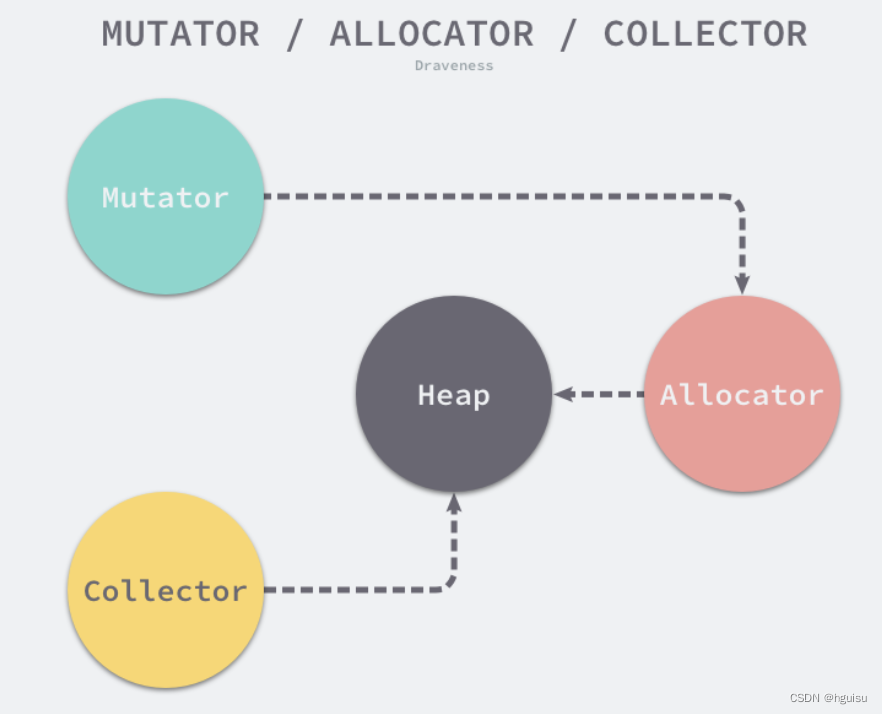

# 详解垃圾回收机制（GC）

垃圾回收机制，又称 GC（Garbage Collection）是一种自动内存管理机制。

编程语言会使用自动或手动两种方式管理内存。手动内存管理需要用户显式地分配和释放内存资源，以避免内存泄漏和内存溢出问题，如：`C`、`C++`、`Assembly`、`Rust`。自动内存管理通常使用垃圾收集机制来自动管理内存，让开发者有更多精力去关注软件设计，而不是底层的内存问题，如：`Python`、`Ruby`、`Go`、`Java`。

## 什么是内存

计算机的存储是基于二进制（取值为 0 或者 1）的一种方式，最小的存储单元为比特（bit），八个比特拼在一起组成一个字节（byte），存储范围为 0000,0000 ~ 1111,1111（即 0~255）。**字节是内存的最小存储单元**，一系列字节连续排列在一起就组成了程序设计过程中需要打交道的内存。

### 内存中字节数


## 垃圾如何产生

在编程语言定义一个变量时（如：Python 中执行 `name = "fmw"`），操作系统会调用硬件，在内存中开辟一块空间，将值 "fmw" 存放在这块内存空间中，然后将变量名 name 与这块内存空间的地址绑定在一起，程序通过变量名 name 的调用来唯一访问值 "fmw"。

通过访问变量名（栈区），找到其对应存储的变量值的内存地址，进而访问到变量值（堆区）：

```py
x = 10
y = 20
```



### 直接引用 & 间接引用

通过栈区的变量名直接找到堆区的变量值，这种引用（访问）就是直接引用。

通过从栈区出发引用到堆区后，再进一步引用才能找到变量值的内存地址，这种是间接引用。

```py
x = 10         # 值 10 被变量名 x 直接引用
l2 = [20, 30]  # 列表本身被变量名 l2 直接引用，包含的元素被列表间接引用
l1 = [x, l2]   # 列表本身被变量名 l1 直接引用，包含的元素被列表间接引用
```



### 内存分区

（基于 C 语言内存模型）程序在内存上被分为堆区（Heap）、栈区（Stack）、全局区（Global Area）、代码区（Code Area）、常量区（Constant Area）五个部分。在应用程序中会使用到两种内存，分别为堆（Heap）和栈（Stack），GC 负责回收堆内存，而不负责回收栈中内存。栈是线程的专用内存，专门为了函数执行而准备的，存储着函数中的局部变量以及调用栈，函数执行完后编译器可以将栈上分配的内存直接释放。堆是程序共享的内存，自动内存管理也就是回收在堆上分配的内存。



垃圾是指程序向堆栈申请的内存空间，随着程序的运行已经不再使用这些内存空间，这时如果不释放他们就会造成垃圾也就是内存泄漏。

```go
package main

// 假设每个人都有手机
type Person struct {
    phone *Phone
}

type Phone struct {
    money int
}

func main() {
    // 定义一个人
    p := new(Person)

    // 一开始用的是 iphone12
    iphone := &Phone{money: 6599}
    p.phone = iphone

    // 后来用华为
    huawei := &phone{money: 5899}
    p.phone = huawei
}
```

phone 从 iphone 变成华为后，iphone 所指向的内存空间就变成了垃圾。如果不及时对这些垃圾内存进行回收，就有可能造成内存泄漏。


### 堆的数据结构

## 基于 C 语言的内存模型

### 变量类型总结

<table>
    <tr>
        <th>变量种类</th><th>变量类型</th><th>变量名</th><th>变量声明</th><th>元素类型</th><th>相应的指针类型</th><th>size</th>
    </tr>
    <tr>
        <td rowspan="6">非数组变量</td><td>int</td><td>a</td><td>int a;</td><td>N/A</td><td>int*</td><td>4</td>
    </tr>
    <tr>
        <td>char</td><td>b</td><td>char b;</td><td>N/A</td><td>char*</td><td>1</td>
    </tr>
    <tr>
        <td>float</td><td>c</td><td>float c;</td><td>N/A</td><td>float*</td><td>4</td>
    </tr>
    <tr>
        <td>int*</td><td>d</td><td>int* d;</td><td>N/A</td><td>int**</td><td>4</td>
    </tr>
    <tr>
        <td>char*</td><td>e</td><td>char* e;</td><td>N/A</td><td>char**</td><td>4</td>
    </tr>
    <tr>
        <td>float*</td><td>f</td><td>float* f;</td><td>N/A</td><td>float**</td><td>4</td>
    </tr>
    <tr>
        <td rowspan="6">数组变量</td><td>int[2]</td><td>g</td><td>int g[2];</td><td>int</td><td>int(*)[2]</td><td>8</td>
    </tr>
    <tr>
        <td>char[2][3]</td><td>h</td><td>char h[2][3];</td><td>char[3]</td><td>char(*)[2][3]</td><td>6</td>
    </tr>
    <tr>
        <td>float[2][3][4]</td><td>i</td><td>float i[2][3][4];</td><td>float[3][4]</td><td>float(*)[2][3][4]</td><td>96</td>
    </tr>
    <tr>
        <td>int*[2]</td><td>j</td><td>int* j[2];</td><td>int*</td><td>int*(*)[2]</td><td>8</td>
    </tr>
    <tr>
        <td>char*[2][3]</td><td>k</td><td>char* k[2][3];</td><td>char*[3]</td><td>char*(*)[2][3]</td><td>24</td>
    </tr>
    <tr>
        <td>float*[2][3][4]</td><td>l</td><td>float* l[2][3][4];</td><td>float*[3][4]</td><td>float*(* )[2][3][4]</td><td>96</td>
    </tr>
</table>

### 堆的分配器

Allocator

+ malloc
+ realloc
+ free


## 内存管理组件

垃圾回收器的执行过程被划分为两个半独立的组件：

+ **赋值器（Mutator）**：负责将存活对象从一个内存区域（通常是堆内存）复制到另一个内存区域的组件。
+ **回收器（Collector）**：负责执行垃圾回收的代码。

用户程序（Mutator）会通过内存分配器（Allocator）在堆上申请内存，而垃圾收集器（Collector）负责回收堆上的内存空间，内存分配器和垃圾收集器共同管理着程序中的堆内存空间。



## 垃圾回收常见算法

1. **引用计数**

    > 每个对象维护一个引用计数，当被引用对象被创建或被赋值给其他对象时引用计数自动 +1。如果这个对象被销毁，那么计数 -1，当计数为 0 时，回收该对象。

    + 代表语言：Python、PHP、Swift
    + 优点：对象可以很快被回收，不会出现内存耗尽或者达到阈值才回收。
    + 缺点：不能很好的处理循环引用。

1. **标记-清除**

    > 从根变量开始遍历所有引用的对象，引用的对象标记“被引用”，没有标记的则进行回收。

    + 代表语言：Go
    + 优点：解决了引用计数的缺点。
    + 缺点：需要 STW（stop the world），暂时停止程序运行。

1. **分代回收**

## Go 垃圾回收实现

## Python 的垃圾回收实现

一句话总结就是：引用计数为主，标记清除和分代收集为辅。

Python 对象的核心就是一个结构体：

```c
typedef struct_object {
    int ob_refcnt;
    struct_typeobject *ob_type;
} PyObject;
```

## 参考文章

+ [python变量储存 python变量存储机制](https://blog.51cto.com/u_16099246/7003419)
+ [python垃圾回收机制，面试必备，学完吊打面试官（基于C源码剖析）](https://www.bilibili.com/video/BV15r4y1e7rv)
+ [GO进阶(5) 垃圾回收机制](https://cloud.tencent.com/developer/article/2234479)
